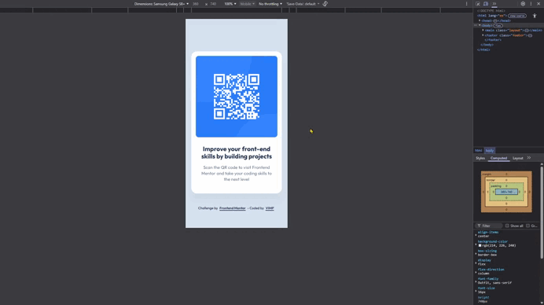

# Frontend Mentor - QR code component solution

This is a solution to the [QR code component challenge on Frontend Mentor](https://www.frontendmentor.io/challenges/qr-code-component-iux_sIO_H).  
Built with semantic HTML, modern CSS and accessibility best practices.

---

## 📸 Screenshots

### 📱 Mobile

### 💻 Desktop

---

## 📽️ Demo

---

## 🔗 Links

- [Live site URL](https://vimpdev.github.io/fem-01-qr-code-component/) ↗️
<!-- - Solution URL: [Add solution URL here](https://your-solution-url.com) -->

---

## 🛠️ Built with

- Semantic HTML5
- CSS custom properties
- Flexbox
- Mobile-first workflow
- Accessibility focus styles (`:focus-visible`)

---

## 🧠 What I learned

- Structuring semantic HTML for small UI components.
- Managing layout using Flexbox.
- Implementing accessible focus states.
- Organizing project assets for production and documentation.

---

## 🤖 AI Collaboration

This project was developed with the assistance of AI tools (ChatGPT) for:

- Debugging browser inconsistencies
- Improving accessibility implementation
- Structuring Git commits professionally
- Optimizing project organization

AI was used as a learning and mentoring tool rather than code generation replacement.

---

## 👤 Author

- Frontend Mentor - [@vimpdev](https://www.frontendmentor.io/profile/vimpdev)
